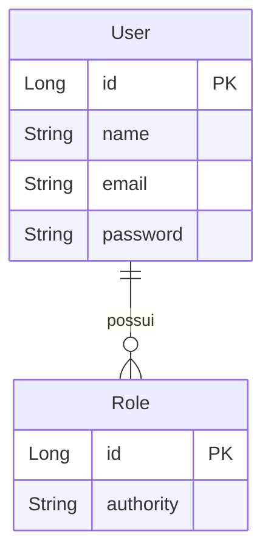

# Desafio DevSuperior - Validação e Segurança

[](https://openjdk.org/projects/jdk/17/)
[](https://spring.io/projects/spring-boot)
[](https://spring.io/projects/spring-security)
[](https://jwt.io/)
[](https://hibernate.org/)
[](https://www.postgresql.org/)
[](https://github.com/Jacques-Trevia/desafio-validacao-seguranca/blob/main/LICENSE)

## 📖 Sobre o Projeto

Este repositório contém a resolução de um **desafio avançado** do curso **Java Spring Expert** da DevSuperior, focado em dois aspectos cruciais para APIs modernas:

- **Validação de dados**: Bean Validation, validações customizadas e respostas de erro padronizadas
- **Segurança**: Autenticação e autorização com OAuth2, JWT (JSON Web Tokens) e Spring Security

O projeto simula um sistema de catálogo (DSCatalog) onde é necessário controlar acesso a recursos como produtos, categorias e usuários, com diferentes níveis de permissão (ADMIN, OPERATOR, etc.).

## 🎯 Objetivo do Desafio

Aprender na prática como:
- Implementar um **sistema de autenticação completo** com Spring Security e OAuth2
- Utilizar **JWT** para geração e validação de tokens
- Controlar **acesso a endpoints** baseado em perfis de usuário (roles)
- Aplicar **validações robustas** nos dados de entrada
- Criar **validações customizadas** para regras de negócio específicas
- Tratar **erros de validação** de forma padronizada

## ✨ Funcionalidades

### Validações Implementadas
- **Validações padrão**: `@NotBlank`, `@Email`, `@Size`, `@Positive`, `@PastOrPresent`
- **Validação customizada**: Exemplo de validação para unicidade de email
- **Tratamento global de exceções**: Respostas padronizadas para erros de validação (422)

### Segurança Implementada
- **Autenticação OAuth2**: Password Grant Flow
- **JWT Tokens**: Geração e validação de tokens assinados
- **Controle de acesso** baseado em roles (ADMIN, OPERATOR, VISITOR)
- **Proteção de endpoints**: Apenas usuários autenticados podem acessar recursos
- **Autorização diferenciada**:
  - Endpoints públicos: login, cadastro
  - Endpoints para OPERATOR/ADMIN: consultas, atualizações
  - Endpoints exclusivos para ADMIN: deleção, criação de usuários

## 🚀 Tecnologias Utilizadas

- **Java 17**: Linguagem de programação.
- **Spring Boot 2.7.x**: Framework principal.
- **Spring Security**: Autenticação e autorização.
- **Spring OAuth2**: Implementação do fluxo OAuth2.
- **JWT**: JSON Web Tokens para tokens stateless.
- **Spring Data JPA**: Abstração para acesso a dados.
- **Hibernate**: Implementação do JPA.
- **PostgreSQL**: Banco de dados relacional em produção.
- **H2 Database**: Banco de dados em memória para testes.
- **Bean Validation**: Validação de dados.
- **Postman**: Teste da API (coleção e environment incluídos).
- **Maven**: Gerenciador de dependências.

## 📁 Estrutura do Projeto
```
src/
├── main/
│ ├── java/com/jacques/desafiovalidacaoseguranca/
│ │ ├── DesafioValidacaoSegurancaApplication.java # Classe principal
│ │ ├── config/ # Configurações de segurança
│ │ │ ├── AuthorizationServerConfig.java # Configuração OAuth2
│ │ │ ├── ResourceServerConfig.java # Configuração resource server
│ │ │ ├── WebSecurityConfig.java # Configuração web security
│ │ │ └── ... (outras configs)
│ │ ├── controllers/ # Endpoints REST
│ │ │ ├── UserController.java
│ │ │ ├── ProductController.java
│ │ │ └── CategoryController.java
│ │ ├── dto/ # Objetos de transferência
│ │ │ ├── UserDTO.java
│ │ │ ├── UserInsertDTO.java (com validações)
│ │ │ └── UserUpdateDTO.java
│ │ ├── entities/ # Entidades JPA
│ │ │ ├── User.java
│ │ │ ├── Role.java
│ │ │ ├── Product.java
│ │ │ └── Category.java
│ │ ├── repositories/ # Camada de acesso a dados
│ │ │ ├── UserRepository.java
│ │ │ ├── RoleRepository.java
│ │ │ └── ...
│ │ ├── services/ # Camada de negócio
│ │ │ ├── UserService.java
│ │ │ ├── AuthService.java
│ │ │ └── exceptions/ # Tratamento de exceções
│ │ │ ├── ResourceNotFoundException.java
│ │ │ ├── ValidationException.java
│ │ │ └── ResourceExceptionHandler.java
│ │ └── validation/ # Validações customizadas
│ │ ├── UserInsertValid.java (anotação customizada)
│ │ └── UserInsertValidator.java (implementação)
│ └── resources/
│ ├── application.properties # Configurações da aplicação
│ └── import.sql # Dados de teste
└── test/ # Testes unitários e de integração
```

## 🗺️ Modelo de Domínio


Relacionamentos:

User → Role: ManyToMany (um usuário pode ter múltiplos papéis)

Roles disponíveis: ROLE_ADMIN, ROLE_OPERATOR, ROLE_VISITOR (exemplo)

## 🔐 Fluxo de Autenticação OAuth2 com JWT

## ▶️ Como Executar o Projeto
Pré-requisitos
JDK 17 ou superior

Maven (ou utilizar o wrapper ./mvnw)

PostgreSQL instalado (ou Docker com PostgreSQL)

Passos
Clone o repositório:

bash
```
git clone https://github.com/Jacques-Trevia/desafio-validacao-seguranca.git
cd desafio-validacao-seguranca
```
Configure o banco de dados:

Crie um banco PostgreSQL (ex: dscatalog)

Configure application.properties:

properties
```
spring.datasource.url=jdbc:postgresql://localhost:5432/dscatalog
spring.datasource.username=seu_usuario
spring.datasource.password=sua_senha
```
Execute o projeto:

bash
```
./mvnw spring-boot:run
```
A API estará disponível em http://localhost:8080.

## 🔌 Endpoints e Controle de Acesso

Método	Endpoint	Permissão	Descrição
```
POST	/oauth/token	Público	Obter token JWT
POST	/users	Público	Criar novo usuário (cadastro)
GET	/users/me	Autenticado	Buscar perfil do usuário logado
GET	/users	ADMIN	Listar todos os usuários
PUT	/users/{id}	ADMIN ou próprio usuário	Atualizar usuário
DELETE	/users/{id}	ADMIN	Deletar usuário
GET	/products	Autenticado	Listar produtos
POST	/products	OPERATOR/ADMIN	Inserir produto
PUT	/products/{id}	OPERATOR/ADMIN	Atualizar produto
DELETE	/products/{id}	ADMIN	Deletar produto
```

## 🧪 Validações Implementadas
Exemplo de DTO com Validações

```
public class UserInsertDTO {
    
    @NotBlank(message = "Nome não pode estar em branco")
    @Size(min = 3, max = 80, message = "Nome deve ter entre 3 e 80 caracteres")
    private String name;
    
    @NotBlank(message = "Email não pode estar em branco")
    @Email(message = "Email inválido")
    private String email;
    
    @NotBlank(message = "Senha não pode estar em branco")
    @Size(min = 6, message = "Senha deve ter no mínimo 6 caracteres")
    private String password;
    
    // getters e setters
}
```
Validação Customizada (Unicidade de Email)
```
@Target({ElementType.TYPE})
@Retention(RetentionPolicy.RUNTIME)
@Constraint(validatedBy = UserInsertValidator.class)
public @interface UserInsertValid {
    String message() default "Erro de validação";
    Class<?>[] groups() default {};
    Class<? extends Payload>[] payload() default {};
}
```
Exemplo de Resposta de Erro (422)
```
json
{
    "timestamp": "2025-06-18T10:30:00Z",
    "status": 422,
    "error": "Unprocessable Entity",
    "message": "Validation error",
    "path": "/users",
    "errors": [
        {"field": "email", "message": "Email já cadastrado no sistema"},
        {"field": "password", "message": "Senha deve ter no mínimo 6 caracteres"}
    ]
}
```

## 📦 Como Testar a API (Postman)
O repositório inclui dois arquivos essenciais para testes:

```
Desafio Validação e Segurança.postman_collection.json: Coleção com todas as requisições

DSCatalog env.postman_environment.json: Environment com variáveis (base_url, client_id, client_secret)
```

Passos para testar:
```
Importe a coleção e o environment no Postman

Selecione o environment "DSCatalog env"
```
Obter token:
```
Endpoint: POST {{base_url}}/oauth/token

Body (x-www-form-urlencoded):

username: admin@email.com
password: 123456
grant_type: password
Headers: Authorization: Basic {{client_id}}:{{client_secret}} (Base64)

Use o token retornado nas requisições protegidas
```

Teste os endpoints com diferentes perfis de usuário

## 🔑 Credenciais de Teste (import.sql)

O arquivo import.sql popula dados iniciais:

-- Roles
```
INSERT INTO tb_role (authority) VALUES ('ROLE_ADMIN'), ('ROLE_OPERATOR');
```

-- Usuário Admin
```
INSERT INTO tb_user (name, email, password) 
VALUES ('Admin', 'admin@email.com', '$2a$10$...'); -- senha: 123456
```
-- Associações
```
INSERT INTO tb_user_role (user_id, role_id) VALUES (1, 1), (1, 2);
```

## 📚 Aprendizados
Este desafio permitiu praticar:

✅ Validação de dados com Bean Validation (@NotBlank, @Email, @Size)

✅ Validações customizadas com anotações e validadores próprios

✅ Tratamento global de exceções com @ControllerAdvice

✅ Spring Security + OAuth2: Configuração completa de Authorization Server e Resource Server

✅ JWT Tokens: Geração, assinatura e validação

✅ Controle de acesso baseado em roles (@PreAuthorize)

✅ Criptografia de senhas com BCrypt

✅ Teste da API com Postman (coleção e environment)

---

## 📜 Licença

Este projeto é parte do curso da **DevSuperior** e tem propósito educacional.

---

## 👨‍💻 Autor

**Jacques Araujo Trevia Filho**

[](https://www.linkedin.com/in/jacques-trevia)
[](https://github.com/Jacques-Trevia)
